# Cloud Computing

Cloud computing is the delivery of computing services—like servers, storage, databases, networking, software—over the internet ("the cloud").

Instead of owning and maintaining physical servers, you can:
- Rent resources on demand
- Pay only for what you use
- Scale up/down easily

There are 3 main types:
- IaaS (Infrastructure as a Service) – e.g., AWS EC2
- PaaS (Platform as a Service) – e.g., Heroku
- SaaS (Software as a Service) – e.g., Gmail, Dropbox

## Advantages of Cloud

1. Cost-Efficient – No need to buy and maintain expensive hardware. Pay-as-you-go model.
2. Scalability – Easily scale resources up or down based on demand.
3. Flexibility & Accessibility – Access data and apps from anywhere via the internet.
4. Disaster Recovery – Built-in backup and recovery options reduce data loss risks.
5. Automatic Updates – Providers handle software and security updates. 
6. High Performance – Global network of servers ensures fast performance and low latency.

## Types of Cloud

1. Private Cloud: Exclusively by one buisness or Organization.
2. Public Cloud: The cloud resources (like servers and storage) are owned and operated by a third party cloud service Provider and delivered over the internet.
3. Hybrid Cloud: Often call 'the best of both worlds' hybird cloud combine on-premises infrastructure clouds so organisationn can reap the advantage of both.

## Service of Cloud


## Global Infrastructure Layers

### Regions:
Geographic areas (e.g., Mumbai, Sydney). Each region comprises multiple, physically separated Availability Zones (AZs).

### Availability Zones (AZs): 
Essentially data centers within a region, designed to be isolated from failures in other AZs.

### Edge Locations / CDN: 
Servers positioned globally to accelerate content delivery using services like Amazon CloudFront.

## AWS OUTPOST
AWS Outposts lets you run AWS infrastructure and services on-premises (in your own data center or office), while still being fully managed by AWS.

### Key Features

- **On-Prem + AWS Integration**: Run AWS services like EC2, ECS, EBS, and RDS on physical servers installed at your location.

- **Low Latency**: Ideal for workloads needing ultra-low latency or local data processing.

- **Consistent APIs**: Use the same APIs, tools, and services as you do in AWS cloud.

- **Fully Managed**: AWS delivers, installs, manages, and supports the Outposts hardware.


### AWS WaveLength
AWS Wavelength brings AWS services to the edge of 5G networks, allowing developers to build apps that deliver ultra-low latency to mobile and connected devices.

#### 🚀 Key Highlights:

| Feature | Details |
|---------|---------|
| Purpose | Ultra-low latency apps (gaming, AR/VR, live video, IoT, ML) |
| Latency | 5–20 milliseconds (ms), much lower than traditional cloud access |
| Location | Deployed within telecom providers' 5G networks |
| Services Available | Subset of AWS: EC2, EBS, VPC, Load Balancer, etc. |
| Same Tools | Uses familiar AWS APIs & services, just deployed closer to end-users |


## part-2

## what is aws EC2?
EC2 stands for Elastic Compute Cloud, a key IaaS (Infrastructure as a Service) from AWS.

Offers scalable virtual servers (“instances”) that you can launch on-demand in the cloud.

initially, we use hypervisor to run multiple operting system . This is called virtualization.

-Scalability & Elasticity: Easily scale up or down based on workload.

-Pay-as-you-go: Only pay for compute time used.

-Variety of instance types: Options optimized for CPU, memory, storage, or GPU workloads.


## practical on creatig Ec2 remaining-12


## What is AWS AMI?
Amazon Machine Image: An AWS AMI (Amazon Machine Image) is a pre-configured template used to launch EC2 instances (virtual servers) on AWS.

### 🔹 Key Points:

*   **Contains**:
    
    *   OS (e.g., Linux, Windows)
        
    *   System settings
        
    *   Application server (optional)[ microsoft window sql server]
        
    *   Installed software (optional)
        
*   **UseCase**:
    
    *    Rapdi instance Deployment of EC2 instance
    *    Load Balancing and Sacaling.
    *    Environment Cloning
    *    Diaster Recovery

**Types**:

1.  **AWS-provided AMIs** – Basic OS like Ubuntu, Amazon Linux, etc.
    
2.  **Marketplace AMIs** – Provided by vendors (e.g., WordPress, Red Hat).
    
3.  **Custom AMIs** – Created by you for consistent deployment.


# 🌐 Private IP vs Public IP on AWS EC2 (Day 17)

## 🔹 Private IP
- Used for internal communication within the VPC.
- Static (doesn’t change while instance runs).
- Not accessible from the internet.

## 🔹 Public IP
- Assigned automatically at launch (if enabled).
- Used for internet access.
- Changes if the instance is stopped/started.

we can access the instance with  private ip  via public Ip instance. that means access the public IP instance then access the Private IP instance.

# 🌐 Types of AWS EC2 Instances(part -18)


## what is Nitro instance-
Normal instance access hardware access using hypervisor but nitro instance directly hardware bypassing the hypervisor. 


# 🌐 Networking Setting- 19

Q> what is AWS multi AZ(avaibility zone) in aws?

Multi-AZ (Multi Availability Zone) is a high-availability architecture in AWS where your resources (like EC2, RDS, etc.) are replicated across multiple Availability Zones within a region.


# 🌐 What is EC2 Security group? Day 20/100 :  part-1

An EC2 Security Group acts as a virtual firewall for your EC2 instances to control inbound and outbound traffic.


- **Attached to EC2 instances**.56+
- Works at the **instance level**, not at the subnet level.
- Define rules based on:
  - **Protocol** (e.g., TCP, UDP, ICMP)
  - **Port range** (e.g., 22 for SSH, 80 for HTTP)
  - **Source/Destination**:
    - IP address
    - CIDR block (e.g., 0.0.0.0/0)
    - Another security group

# why security group is stateful
 An EC2 Security Group is called stateful because:-
If you allow inbound traffic, the response traffic is automatically allowed—without needing an explicit outbound rule, and vice versa.
( need to verfiy about - allowing  inbound or outbound)


#  aws User Data Script: day 24
It’s a shell script (or cloud-init directive) you attach to an EC2 instance at launch time to automate setup tasks like installing software, updating packages, or configuring the server.


Your instance will automatically run this script once, on first boot.


# Aws Instance Termination Protection
A feature that prevents accidental termination (deletion) of your EC2 instance.


# Aws ec2 Placement Group:26
A placement group in AWS is a logical grouping of EC2 instances within a single Availability Zone that enables low-latency, high network throughput interactions between instances.
- **Cluster Placement Group**: This type groups instances in a low-latency network, which is ideal for applications that require high performance and low latency, such as high-performance computing (HPC) applications.
 However, cluster placement groups cannot span multiple Availability Zones, and if the Availability Zone fails, all instances in the group fail.
- **Partition Placement Group**: This type distributes instances across different partitions within an Availability Zone. Each partition represents a rack in AWS, and instances in one partition do not share the same hardware with instances in another partition. This provides high availability and is suitable for large distributed and replicated workloads.

- **Spread Placement Group**: This type places instances on distinct hardware across different Availability Zones, which reduces the risk of simultaneous failures. It is suitable for applications that require maximum high availability.

# Aws Tenancy: day 27
Determine how the physical hardware on which your instances run is shared with other AWS accounts.

1. Shared(Default)
2. Dedicated Instance (no shared beteen physical host )
3. Dedicated Host(full control)


# AWS Pricing Plan: day 28;


# elastic IP :Day 32

We know every time when we restart the instance then new IP address assign. But If we want to use the same ip,then we can purchase the elastic IP.


# what is instance Store? day:34

In AWS, Instance Store is temporary block-level storage physically attached to the host machine. Here's a quick breakdown:;

- Also called ephemeral storage.
- Provides high-speed, low-latency storage.
- Data is lost when the instance stops, terminates, or fails.

## what is Elastic Block Storage (EBS)?

Amazon EBS (Elastic Block Store) is persistent block-level storage for EC2 instances.

Data persists even after instance stops or terminates.
Can attach/detach volums across instance.
Data stored in multiple AZs

## Difference between EC2 instance store and EBS store


# AWS EBS Volume Types: GP2, GP3, and Provisioned IOPS

Amazon Elastic Block Store (EBS) provides persistent block storage for EC2 instances. Below are the key general-purpose and performance-oriented EBS volume types.

---

## 1. General Purpose SSD (gp2)

- **Purpose**: Balanced price/performance for a wide variety of workloads.
- **Baseline Performance**:
  - 3 IOPS per GB (e.g., 100 GB = 300 IOPS)
  - Up to 16,000 IOPS per volume
- **Burst Performance**:
  - Volumes under 1 TB can burst to 3,000 IOPS using a credit system.
- **Max Throughput**: 250 MB/s
- **Use Cases**:
  - Boot volumes
  - Small to medium-sized databases
  - Development and test environments
- **Limitation**:
  - Performance tied to volume size.

---

## 2. General Purpose SSD (gp3)

- **Purpose**: Successor to gp2 with better performance at lower cost.
- **Baseline Performance**:
  - 3,000 IOPS baseline regardless of volume size
  - Up to 16,000 IOPS
- **Throughput**:
  - 125 MB/s by default
  - Can be provisioned up to 1,000 MB/s
- **Benefits**:
  - Decoupled IOPS and throughput from volume size
  - 20% lower cost than gp2
- **Use Cases**:
  - Similar to gp2 but more cost-efficient and predictable
  - High-performance web servers
  - Gaming and streaming apps

---

## 3. Provisioned IOPS SSD (io1/io2)

- **Purpose**: High-performance storage for mission-critical applications.
- **Provisioned IOPS**:
  - io1: Up to 64,000 IOPS (Nitro-based EC2)
  - io2: Up to 256,000 IOPS (Nitro-based EC2)
- **Throughput**:
  - io1: Up to 1,000 MB/s
  - io2: Up to 4,000 MB/s
- **Durability**:
  - io2 has 99.999% durability (higher than io1)
- **Use Cases**:
  - Large relational/NoSQL databases (e.g., Oracle, SQL Server, MongoDB)
  - Critical workloads requiring sustained high IOPS

---

## Summary Table

| Volume Type | Max IOPS | Max Throughput | Baseline IOPS | Cost-efficiency | Use Cases |
|-------------|----------|----------------|----------------|------------------|-----------|
| gp2         | 16,000   | 250 MB/s       | 3 IOPS/GB      | Moderate         | General-purpose workloads |
| gp3         | 16,000   | 1,000 MB/s     | 3,000 IOPS     | High             | Cost-effective performance |
| io1/io2     | 64K/256K | 1GB/s–4GB/s    | Provisioned    | Low (premium)    | High IOPS, mission-critical apps |

---

## Choosing the Right Volume Type

- Use **gp3** over gp2 for most general-purpose needs.
- Use **io1/io2** for databases and applications with high IOPS/throughput/durability needs.


# AWS Snapshot: Day 40

## What is a Snapshot?

A **snapshot** in AWS is a point-in-time backup of an Amazon EBS (Elastic Block Store) volume.

## Key Features

- **Backup**: Stores a backup of your EBS volume.
- **Incremental**: Only changes made after the last snapshot are saved.
- **Stored in S3**: Though not directly accessible through the S3 interface.
- **Restoration**: Can be used to create new EBS volumes or restore old ones.
- **Use in AMIs**: Can be used to create Amazon Machine Images (AMIs).

## Use Cases

- **Disaster Recovery**: Restore data after failure.
- **Data Migration**: Move data between regions or accounts.
- **Version Control**: Maintain different states of data over time.

## How to Create a Snapshot

### Using AWS Console:
1. Go to EC2 Dashboard.
2. Click on "Volumes" under Elastic Block Store.
3. Select a volume.
4. Click on **Actions > Create Snapshot**.
5. Provide a name and description, then create.

### Using AWS CLI:
```bash
aws ec2 create-snapshot --volume-id vol-1234567890abcdef0 --description "My snapshot"
```

# Day - 41 : Practical of AWS snapshot and their uses

[link](https://www.youtube.com/watch?v=y3ORzlAqTIU&list=PLIm9KY-ideOsCuwMRoX1ltMZGuNZeBrRp&index=41)

# DAY - 42: AWS Fast Snapshot Restore (FSR)

## 🚀 What is Fast Snapshot Restore?

**Fast Snapshot Restore (FSR)** is an AWS feature that enables **low-latency, fully-initialized EBS volumes** from snapshots. Without FSR, volumes created from snapshots may experience **initial I/O latency** as data is loaded lazily from Amazon S3.

## 🧠 Why Use FSR?

- Avoid performance hit during initial read operations.
- Ideal for **production workloads**, **disaster recovery**, and **automated scaling**.
- Speeds up instance launch time from snapshots (especially for large EBS volumes).

## ✅ Key Features

- Supported on **EBS General Purpose SSD (gp2, gp3)** and **Provisioned IOPS SSD (io1, io2)**.
- Enabled **per Availability Zone**, **per snapshot**.
- Charges **per AZ per hour** while FSR is enabled.

## 💸 Pricing

You are charged **per snapshot per Availability Zone per hour** where FSR is enabled.  
Refer to official pricing: [AWS EBS Pricing](https://aws.amazon.com/ebs/pricing/)

## ⚙️ Enabling FSR (CLI Example)

```bash
aws ec2 enable-fast-snapshot-restores \
  --source-snapshot-ids snap-1234567890abcdef0 \
  --availability-zones us-east-1a
  ```

# Day 43: EBS Lifecycle Manager (DLM) – Automated Snapshots and Backup

## 🔹 What is EBS Lifecycle Manager (DLM)?

[EBS Lifecycle Manager](#) is an AWS feature that **automates the creation, retention, and deletion of Amazon EBS snapshots**. It helps enforce backup policies without manual intervention.

---

## 🔹 Key Features

- ✅ **Automated Backups**: Schedule snapshot creation based on policies.
- ♻️ **Retention Rules**: Automatically delete old snapshots after a specified time.
- 🔒 **Cross-account Copy**: Share and copy snapshots to another AWS account.
- 📅 **Daily, Weekly, Hourly** schedule support.
- 🔁 **Fast Snapshot Restore (FSR)** integration.

---

## 🔹 How It Works

1. **Create a Lifecycle Policy**
   - Define target resources (via **tags**).
   - Set schedule frequency (e.g., daily at 5 AM).
   - Configure retention (e.g., keep 7 days of backups).
2. **DLM runs automatically** based on your rules.
3. **Snapshots are created and deleted** without manual effort.

---
# What is EFS? | AWS Elastic File System DAY:44

## 🔹 Overview

[Amazon Elastic File System (EFS)](w) is a **fully managed, scalable, NFS-based cloud file storage** system. It allows multiple [EC2 instances](w) to access the **same file system simultaneously**, making it ideal for **shared storage** use cases.

---

## 🔹 Key Features

- 📂 **Shared Storage**: Multiple EC2 instances across **Availability Zones** can mount the same EFS.
- 📈 **Elastic**: Automatically scales up/down as files are added or removed.
- 🔒 **Secure**: Integrated with [IAM](w), [VPC](w), [KMS](w) for access control and encryption.
- 🌐 **Highly Available**: Data is stored redundantly across multiple [AZs](w).
- 🏷️ **POSIX-compliant**: Supports standard Linux file permissions.

---

## 🔹 Use Cases

- 🖥️ **Web server farms** (e.g., Apache, Nginx)
- 📊 **Big data analytics**
- 📁 **Content management systems**
- 🤝 **Home directories and user file storage**
- 🧠 **Machine learning workloads**

---

## 🔹 EFS vs Other Storage Options

| Feature          | EFS                         | EBS                        | S3                      |
|------------------|------------------------------|-----------------------------|--------------------------|
| Access           | Shared (multi-AZ)            | Single EC2 instance         | Web/App access           |
| Protocol         | NFS                          | Block storage               | HTTP-based (object)      |
| Use Case         | Shared file system           | Boot volumes, databases     | Static content, backup   |
| Scaling          | Auto                         | Manual                      | Auto                     |

---

## 🔹 Mounting EFS

1. **Create EFS file system** in the AWS Console.
2. **Attach to EC2** via mount targets in VPC subnets.
3. **Mount using NFS** from EC2:
```bash
sudo mkdir /mnt/efs
sudo mount -t nfs4 -o nfsvers=4.1 fs-12345678.efs.us-east-1.amazonaws.com:/ /mnt/efs
```
# AWS EFS: Day - 45 


When we create a EFS file system then we can customized it based on our requirment.

## Option Avilable for customization:

Storage Class
  - standar: Storage data redundant.
  - One Zone: stores data redundancy within a single AZ.

LifeCycle Management- 
   - Transition into IA(infrequent access) - It will keep our cold data  in infrequent access and give you. 
   - Transition out ot IA - if you access your data then automatically keep that in standard storage.


## Performance Setting:
 Through Mode- How much data you can store in your storage. 
 Enhanced-
 Burstinng - if you store 1 GiB data then performance will be 1kiB that means how much data you store that much performance is you get.

 Enhanced 
  >elastic- how much need ? \
  >provisioned- you can enter your requirement.


# 46 -labs

# what is  amazon FSX?                                 
>It is a fully managed file storage service provided by AWS. \
> launch and run feature and highly optimize third party file system
> You can access FSX file system from 
   - EC2 instance
   - Amazon ECS
   - EKS
  - On premises
  > The services is designed to support various workloads , such as \
    - Amazon fsx for NetApp ONTAP.\
    - amazon fsx for openzf. \
    - amazon fsx for windows file server.\
    - amazon fsx for lustre

## amazon fsx Benefits;
 - fully managed
 - scalable
- performance
- secure
- cost-effective

## use cases for Amazon FSX 
 - list and shift of windows based application
 - file sharing and collaboration
 - High Performance computing(HPC) workloads
 - Backup and disaster recovery

# What is NetApp ONTAP?
1. NetApp is MNC company known for its data management storage, formar known as netwok appliance.
2. Netapp provides know for NAS(Network attached stroage) product and services and holding a resputation for reliabilty and services.
3. NetApp provides these data management services.
  - Data Storage
  - Data Protection
  - Data Management
  - Data Sharing

4. NetApp one of the most significant and well known flagship storage operating system is NetApp ONTAP.


## subtopic -ONTAP 
1. ONTAP is essentially a operating system for data management.
2. Just like the operating system on your computer handles all your files and runs your program , ONTAP managest all the data storage tasks for large buisness.
3. NetApp ONTAP  comes in various form, designed to suit different deployment methods and buisness needs.
4. Each product under the ONTAP umberalla maintains the core functionalities of ONTAP but is is tailed for specfic sceario.
5. Here is the list 
 - ONTAP-9: This is flagship ONTAP software.Operated on dedicated netapp hardware.
 - ONTAP select : ONTAP select is software defined storage solution.Deployed as a virtual appliances on a company existing hardware.
  - Cloud Volume ONTAP ( CVO): specially designed for cloud environement. Cloud Volume ONTAP is the ONTAP softwar used in cloud services like aws, google cloud, Azure.it provied same ONTAP experience in the cloud. 
### ONTAP Feature :
 - latency < 1ms
  - Max throughput per file system 4-6GB
  - cliet compability: Window , linux , macos,
  - Protocol support : SMB , NFS,  ISCSI(shared block storage)
  - AWS computer:EC2, ECS, EKS
  - Active directory support
  - Deployment OPtions: single AZ, Multi AZ
  - Avaiblity SLA : single Ax, multi AZ


  

  ##  do later - 


# AWS FSx for Windows File Server: Day - 52

## Overview
- **Amazon FSx for Windows File Server** is a fully managed file storage service built on Windows Server.
- Designed for applications that require file storage with the **SMB protocol** and **Windows NTFS** features.

## Key Features
- **Fully Managed**: Automated backups, patching, and monitoring.
- **Native Windows Compatibility**: Supports Active Directory (AD), DFS Namespaces, Access Control Lists (ACLs).
- **Scalable Storage**: From 32 GiB to 64 TiB per file system.
- **High Performance**: SSD and HDD storage options, high throughput, and low latency.

## Use Cases
- Home directories
- Lift-and-shift Windows applications
- Microsoft SQL Server databases
- Enterprise applications requiring shared storage

## Integration
- Integrates with **AWS Directory Service**, **Amazon EC2**, **VPC**, and **CloudWatch**.

## Security
- **Encryption**: In-transit and at-rest using AWS KMS.
- **Access Control**: Integrates with AD for user authentication and permissions.

## Pricing
- Based on storage size, throughput capacity, and backup requirements.


# Active Directory (AD) - Basic Concepts

## What is Active Directory?
Active Directory (AD) is a **directory service** developed by **Microsoft** for **Windows domain networks**. It helps manage and store information about network resources and application-specific data from a centralized location.
or It is the authentication service for windows.
## Core Purpose
- Acts as a **centralized database** for user accounts, computers, printers, and more.
- Provides **authentication** and **authorization** services.

## Key Components

### 1. **Domain**
- Logical grouping of network objects (users, devices).
- Managed by a **Domain Controller (DC)**.

### 2. **Domain Controller (DC)**
- A server that runs Active Directory services.
- Handles login requests, authentication, and directory lookups.

### 3. **Organizational Unit (OU)**
- Containers within a domain to organize users, groups, and computers.
- Used for applying **Group Policies**.

### 4. **Group Policy**
- Enables centralized configuration and management of user and computer settings.
- Applied through GPOs (Group Policy Objects).

### 5. **LDAP**
- AD uses **Lightweight Directory Access Protocol** to read/write directory information.

### 6. **Kerberos**
- Default authentication protocol used by AD for secure login.

## Benefits
- **Centralized management** of users and computers.
- **Enhanced security** through policies and permissions.
- **Scalable and flexible** for enterprises.

## Analogy
Active Directory is like a company's digital phonebook:
- Every employee (user) is listed.
- Their roles, departments, and access levels are defined.
- Admins can control who can see or do what from one place.


# Day - 54  & 55 (practical)


# 🧠 Amazon FSx for Lustre – Notes  Day 56

## 🔹 What is FSx for Lustre?
- Fully managed **parallel file system** for high-performance computing (HPC).
- Integrates with **Amazon S3** – enables high-speed processing of S3 data.
- Based on **Lustre**, a widely-used open-source file system in HPC.

---

## 🔹 Key Features
- ✅ **High Throughput & Low Latency**:
  - Ideal for machine learning, big data, video rendering, and financial modeling.
- 🔁 **S3 Integration**:
  - Automatically imports S3 objects into Lustre file system.
  - Can export results back to S3.
- 🚀 **Performance**:
  - Up to **100s of GBps throughput**, millions of IOPS.
- 🛠️ **Fully Managed**:
  - No need to handle provisioning, patching, or backups.
- 📁 **POSIX-compliant file system**:
  - Native support for Linux-based workloads.

---

## 🔹 Use Cases
- Machine Learning training pipelines
- Genomics, seismic analysis
- Media processing (render farms)
- Financial simulations
- Large-scale log processing

---

## 🔹 Deployment & Access
- Can be deployed in VPC like other FSx services.
- Access via EC2 instances or on-premise systems (via Direct Connect/VPN).
- Supports encryption, VPC security groups, IAM roles.

---

## 🔹 Storage Options
- **Scratch file systems**: temporary storage, no replication.
- **Persistent file systems**: long-term storage with replication.

---

## 🔹 Benefits
- Faster processing of large datasets.
- Pay only for what you use.
- Scales to petabytes.
- Easy integration with S3.

---

## 🔹 Limitations
- Mainly optimized for **Linux**.
- No native Windows support (use FSx for Windows File Server instead).


**################################################**

# ☁️ Amazon VPC (Virtual Private Cloud) – Notes DAY:57

## 🔹 What is VPC?
- A logically isolated section of AWS cloud.
- You define the IP address range, subnets, route tables, gateways, etc.
- Acts like your own **private data center** on AWS.

---

## 🔹 Key Components

### ✅ CIDR Block
- IP range for your VPC (e.g., `10.0.0.0/16`)
- Max: `/16` (65,536 IPs), Min: `/28` (16 IPs)

### ✅ Subnets
- Divide your VPC into **public** and **private** subnets.
- **Public Subnet**: Has route to Internet Gateway.
- **Private Subnet**: No direct internet access.

### ✅ Route Tables
- Control traffic routing within VPC.
- Public subnets have a route to Internet Gateway (IGW).
- Private subnets use NAT Gateway/Instance for internet-bound traffic.

### ✅ Internet Gateway (IGW)
- Enables internet access for instances in **public** subnet.

### ✅ NAT Gateway / NAT Instance
- Allows instances in **private** subnet to access the internet (outbound only).
- NAT Gateway is managed, scalable & preferred.

### ✅ Security Group
- Virtual firewall for EC2 instances.
- **Stateful**: Return traffic is automatically allowed.

### ✅ Network ACL (NACL)
- Firewall at **subnet level**.
- **Stateless**: You must allow both inbound and outbound rules.

### ✅ VPC Peering
- Connect two VPCs privately.
- Must update route tables to allow communication.

### ✅ VPC Endpoints
- **Interface Endpoint**: Connect to AWS services via private IP.
- **Gateway Endpoint**: For S3 & DynamoDB.

---

## 🔹 VPC Design Best Practices
- Use multiple Availability Zones (AZs) for high availability.
- Separate public/private workloads into respective subnets.
- Use NACLs for broad access control; SGs for instance-level control.
- Enable **Flow Logs** for monitoring VPC traffic.

---

## 🔹 Use Cases
- Host secure web applications.
- Deploy multi-tier architectures (web + app + DB).
- Create hybrid cloud via VPN or AWS Direct Connect.

## 5 step to create VPC:

1. Give VPC name
2. Add assign private IP
3. Add subnet
4. 


* Important-
We can create any number of subet with in AZ.
if We have 3 AZ in a region, then we need to create atleast 3 subnet for each AZ.

CIDR block issue:  we can not assign same CIDR block in other VPC.

solution -1 : Edit VPC and add a new IP4 CIDR and use it.
limitation: But we can add atmost 5 CIDR block.

solution - 2 : We need to  generate the subnet for for Private IP block.

Eg:- we need to two different ip block then.
we have a CIDR block: 192.168.0.0/24

we need two subnet then 

192.168.0.0/25
192.168.0.128/25


# Day-61: How to create AWS Public Subnet , Private Subnet?

public Subnet: A subnet that has a route to the internet gateway , allowinng resources inside it to send receive traffic from te internet directly.


Private Subnet: A subnet that does not have a route to te internet GateWay. Resources in it can only access the internet through a NAT Gte or Basiton host and are not Directly accessible from thhe internet.


# Day -62: AWS VPC (Virtual Private Cloud)- Internet Gateway (IGW) | What is an Internet Gateway?


## What is an Internet Gateway?
An **Internet Gateway (IGW)** is a horizontally scaled, redundant, and highly available **VPC component** that allows communication between **instances in your VPC and the internet**.

It performs two critical functions:
- **Provides a target** in your VPC route tables for internet-routable traffic.
- **Performs network address translation (NAT)** for instances that have been assigned public IPv4 addresses.

---

## Key Features

- Fully managed and scalable by AWS.
- Enables inbound and outbound access to/from the internet.
- One IGW per VPC.
- Does not cause availability risks or bandwidth constraints.

## Diagram (Conceptual)


example image: 


# Day 63: How to access the private ec2 instance with public instance?
practical done

# Dat-64: What is VPC NAT GATEWAY?
A **NAT (Network Address Translation) Gateway** enables **instances in a private subnet** to **connect to the internet** or other AWS services, but **prevents the internet from initiating connections** with those instances.
  


# Day 65:  VPC Peering in AWS

VPC peering is a networkinng connection between two virtual private clouds that enable traffic to route privately using IPV4 or IPV6 addresses without using:

- Internet Gateway 
- NAT Gateway
- VPN
- AWS Direct Connect


# Day-66 : Summary of VPC from part-1 to part-7


1> **Definition**: A Virtual Private Cloud is a virtual network dedicated to your AWS account within the AWS cloud. It Provide a logically isoltated environment for your aws resource.

**Configruation**:  
- VPC are created with specified range of IP address using CIDR  block notation.
- AWS support IPv4 CIDR bolc between /16 and /28 netmask.
- You can add up to 5 CIDR range within single VPC .

**Maximux VPCs per range:** Default limit is 5 region . but his can be increase upon request.


2. **Subnet** : A subnet is segmentation portion of VPC's IP address range. allowing for organized allocation of IP address.

- **Configruation** : Subnet's are created within AZs.
- **Subnet per VPC** - Default limit 200

3. Public Subnet : Subnet that's accessible from the internet.
Usage: Typicallyt for web server and load balancer.

- Point to consider: requries an intenet gateway for internet access.


4. Private Subnet: Subnet not accessible from the **internet**. Ideal for sensitive server like database.

 - point to remember: Require a NAT  gateway for outbound internet access.


5. **Internet Gatway**:  it is used to connect AWS VPC to the internet.
Configuration: Attached to VPC and routes traffic to from the internet.

 - Point to consider: Public IP is necessary for resources in the public subnet to communication with the internet.


6. NAT gateway: enables instance in a private subnet to access the internet for update and download.

Configuration : Place in public subnet with an elastic IP address.

- Point to consider: No inbound traffic allowed to private subnet through NAT.
- Each NAT  GATEWAY supports up to 55000 simultaneorus connection.
- Bandwidth up to 45 GBPS, depending on the instance type.


7. Route tables: Control where network traffic is directed.
Configraution : 
 - main route table - automatically  create, managed default routing for all subnet.
 - custom Routes tables - created default for specific routing needs.
 - Point for to consider: Define rules to determine network traffic direction.


 Route tables per VPC : default limit is 200.

 Routes per Route table- 50


 # Days-67: AWS Network Access Control List(ACL)| What is NACL.

 Definition : A network access control list(NACL) in AWS is a firewall that controls inbound and outbound at the subnet level in a Virtaul Private Cloud(VPC).


Key points:
- Stateless : Responses myst be explicitly allowd by rules.
- Applies to subnet , no individual instance.
- Container numbered rules( from 1 - 32766) that are evaluated in order.

- Rules speicify ALLOW or DENY for traffic based on
   - Protocol
   - Port range
   - Source/ Destination IP


Difference from Security Groups:

| Feature         | NACL                    | Security Group               |
| --------------- | ----------------------- | ---------------------------- |
| Level           | Subnet-level            | Instance-level               |
| Stateful?       | No (stateless)          | Yes (stateful)               |
| Rule type       | Allow & Deny            | Allow only                   |
| Rule evaluation | In order (lowest first) | All rules evaluated together |


 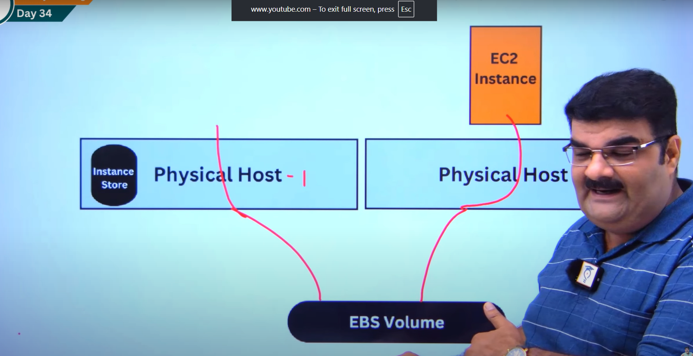


# Day: 68- Compairsion between NACL and Security Group
  
## Security Group:
- Assigned to the instance , load balancer etc. It is like security of office with in building
- Simultaneously apply all the rules
- you can set only allow rule.
- Stateful
## Netwrok Acess control list(NACL)
- Assigned to subnet and apply to all instance with in that subnet. It is like security of whole building.
- Based on roll number. Lower the roll number greater the priority.
- We can select allow and denyy rule.
- stateless


# Day-69 AWS: Stateful vs Stateless (Security Group vs NACL)

Let's understand with a scenario:

When  request is intiated by the interet  then inbound rule should be allow in both condition.

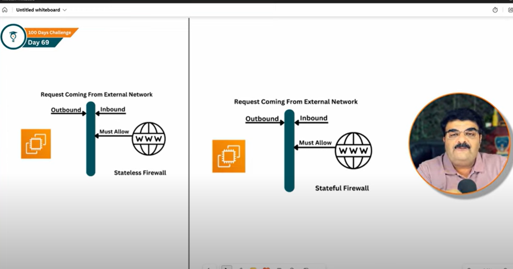


When request is initiated by the EC2 then
- in Stateless firewall, inbound and outbound both should allow explicitly.
- But in case of Statefull firewall, there is not need to inbound rule for that reponse of request from EC2.

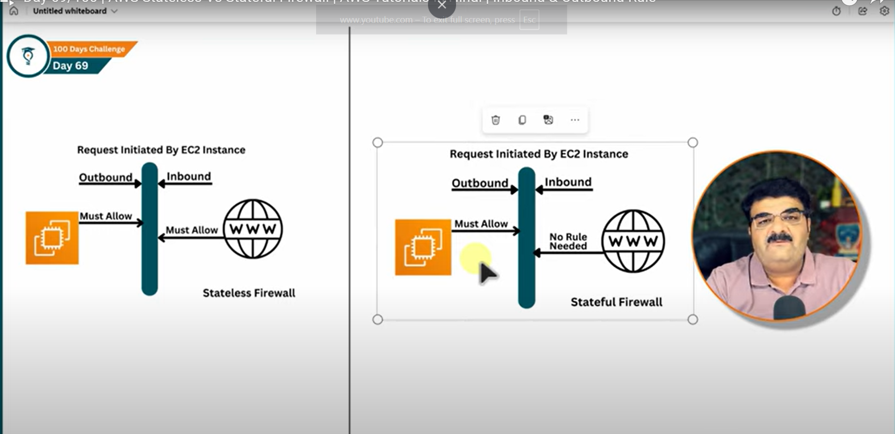


# What is Site to Site VPN (Day -70)
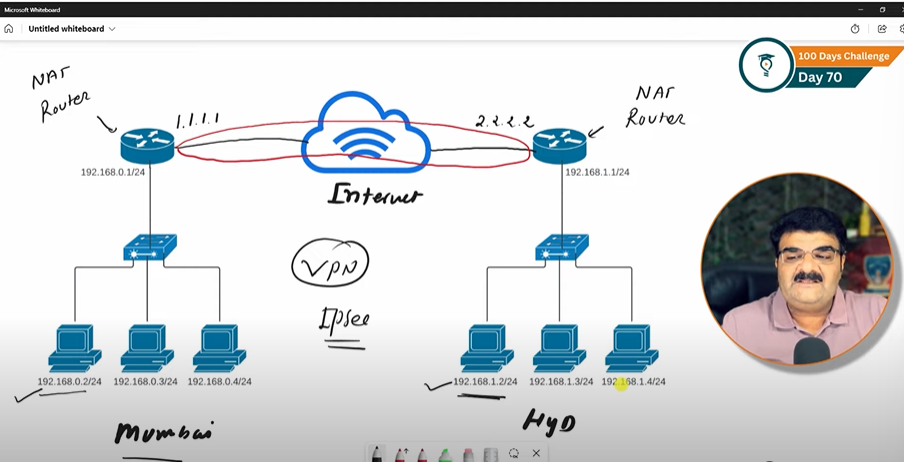

A site to site VPN is a type of virtual private network  that securely connect entire network over the internet. Instead of connecting individual users , it links one network to another allowing devices to communicate 

# Day- 71 practical;

# AWS DIRECT CONNECT  - Day 72

- AWS direct connect is a cloud service solution that makes it easy to eastablish a dedicated network connection
- AWS direct connect is network service that provide an alternative to using the internet to connect customer on premise sites to aws.
- using AWS  direct connect , you can establish private connectivity  between aws and your datacenter, office, colocation  environment which is many cases can reduces your network cost , increase  bankwidth through put and provide a more consistent network experience than internet based connection


# WHAT IS AWS TRANSIT GATEWAY?  DAY-73

Transit gateway is a central networkig hub in AWS.
It allow you to connect
 - VPCs(Virtual Private Clouds)
 - On premises network (via Transit GATEWAY PEERING)
 - Other AWS region (via Transit Gateway peering)

Think of it like a router in the cloud that simplifies complex networking.

why use it:
Without TGW:
If you have 10 VPCs, you’d need 45 VPC peering connections (mesh).

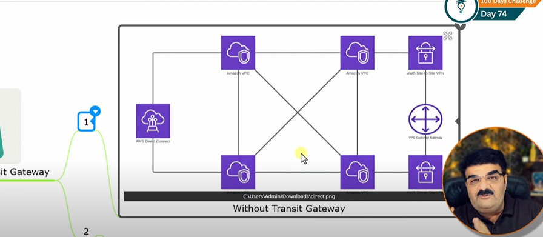

With TGW:
All VPCs connect to one hub.
Easy to manage, fewer connections.
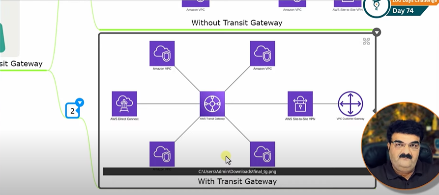


# VPC endpoints:  day - 75  

VPC Endpoint enables you to privately connect your VPC to supported AWS  services and vpc endpoint services powdered by Private Link without requiring
- Internet Gateway
- NAT device
- VPN connection
- aws direct connect connections


Endpoints are virtual devices. They are horizontally scaled, redundant and highly available VPC components that allow communication between  intances in you vpc
 and services without imposing avaibility risks or bandwidth constrainsts on your network traffic.

### Before using VPC Endpoints 
Your EC2 in private subnet need to connect to s3/DynamoDB.
since private subnet has no internet gateway , you must use:
- NAT gateway (extra cost) or
- Public IP + internet gateway

Traffic leaves your VPC and goes over the public internet -> less secure , higher cose

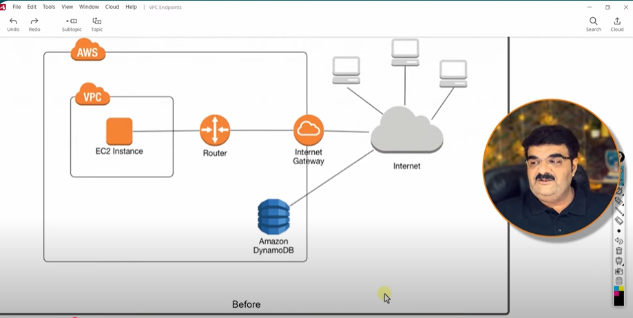


# After using vpc Endpoints
- You create a VPC endpoints (gateway or interface)
- Now you EC2 -> DynamoDB Traffic stays inside AWS Private Network
- No Internet GATEWAY ,no NAT gateway needed
- More secure , chaaper , lower latency
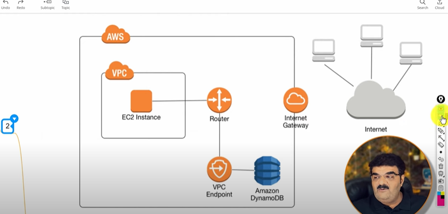


## AWS PRIVATE LINK:
AWS Private link simplifies the security of data shared with cloud based application by eliminating the exposure of data to the public internet.

Aws private link provides private connectivity between VPCs, AWS services and on-premises application , securely on amazon network.


## Type of VPC Endpoint:

1. *GateWay Endpoints* - A gateway endpoint is for supported AWS services only. Your specify a gateway endpoint as route table target for traffci destined to the following AWS services
1. Amazon S3
2. DynamoDB

2. *Interface endpoint* - An interface endpoint is an elastic network interface with a private IP address from the IP address range of your subnet. It serve as an entry point for the traffic destined to a supported AWS services or a VPC endpoint service.Interface endpoint powered by AWS private link.

3. *Gateway loadbalancer endpoints*:  ( cover later) 

# Day - 76 : AWS VPC ENDPOINTS SERVICES 

scenario: let we have two VPC in same region, but in different account one for client and other for service provider.   
 
Now if client want to avial only a particular service from service provider and as both are in same region then it can use the private link instead of  internet.

A VPC(virtual private cloud) endpoint service is like a special doorway that allow you to connect to certain online service in a secure and private way.Instead of going through the  internet.

Endpoint services require either a Network Load Balancer or a gateway load balancer.

consideration:
- An endpoint services is available in the region where you created it.
- You can access the endpoints services from other region using peering
- An endpoint servies support traffic only over TCP.

## before using the endpoint services:
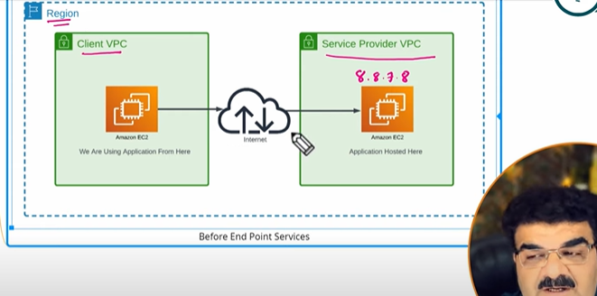

## after using the endpoint services:
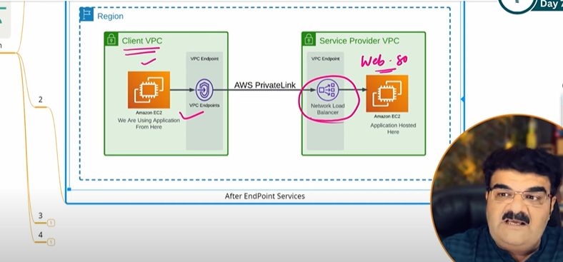


# Day -77: What is AWS DHCP Options sets
In AWS VPC, DHCP(Dynamic Host Configuration Protocol) options set is a configuration resource used to assign default network settings to instances in the VPC.
It lets you control:
- Domain name (eg: example.com)
- Domain name server(DNS) - usually amazonprodidedDNS or custom servers
- NTP server - for time sync
- NetBios name servers & node type - for windos

By default , each vpc has a default DHCP options set.
You can create a custom DHCP options set and associated it with a VPC.


# Day-78: What is AWS vpc flow log?

- Capture IP traffic info for VPC, Subnet, or ENI.  
- Store logs in **CloudWatch** or **S3**.  
- Record: source/destination IP, port, protocol, action (ACCEPT/REJECT).  
- Use cases: troubleshoot, monitor security, compliance.  
- Limitation: no packet payloads.  

# Day-79: What is Customer Manager Prefix List ?

## Definition
A **Customer-Managed Prefix List** is a collection of CIDR blocks (IP ranges) that you create and manage in AWS.

## Key Features
- **Customizable**: You define the CIDR blocks.
- **Reusable**: Reference across Security Groups, NACLs, and Route Tables.
- **Centralized Control**: Update once, reflects everywhere.
- **Integration**: Works with Security Groups, NACLs, Route Tables.

## Benefits
- Reduces repetition of CIDR entries.
- Simplifies management of IP ranges.
- Ensures consistency across resources.

## Types of Prefix Lists
- **Customer-Managed**: Created and controlled by you.
- **AWS-Managed**: Provided by AWS for services like S3, CloudFront, etc.

## Example
- Create prefix list **TrustedNetworks** with:
  - `203.0.113.0/24` (Corporate network)
  - `198.51.100.0/24` (Partner network)  
- Reference *TrustedNetworks* in Security Groups.  
- Updating the prefix list updates all linked resources.


# Day-80: AWS Manager prefix-list:

## Definition
An **AWS-Managed Prefix List** is a collection of CIDR blocks for AWS services, created and maintained by AWS.  
You can reference these lists in your **Security Groups**, **NACLs**, and **Route Tables**.

## Key Features
- **Managed by AWS**: You cannot modify the CIDRs; AWS updates them automatically.
- **Reliable**: Always up to date with the latest service IP ranges.
- **Reusable**: Use the same prefix list across multiple VPC resources.
- **Integration**: Works with Security Groups, Network ACLs, and Route Tables.

## Benefits
- No need to manually track changing IP ranges for AWS services.
- Simplifies rules when allowing access to AWS services (e.g., S3, DynamoDB).
- Reduces configuration errors.

## Example
- Use the **S3 AWS-Managed Prefix List** in a Route Table to allow VPC traffic to Amazon S3.  
- AWS updates the list if S3’s IP ranges change — no manual action required.

---

# DAY-81: AWS ROUTE 53 | DNS SERVERS

8336051413

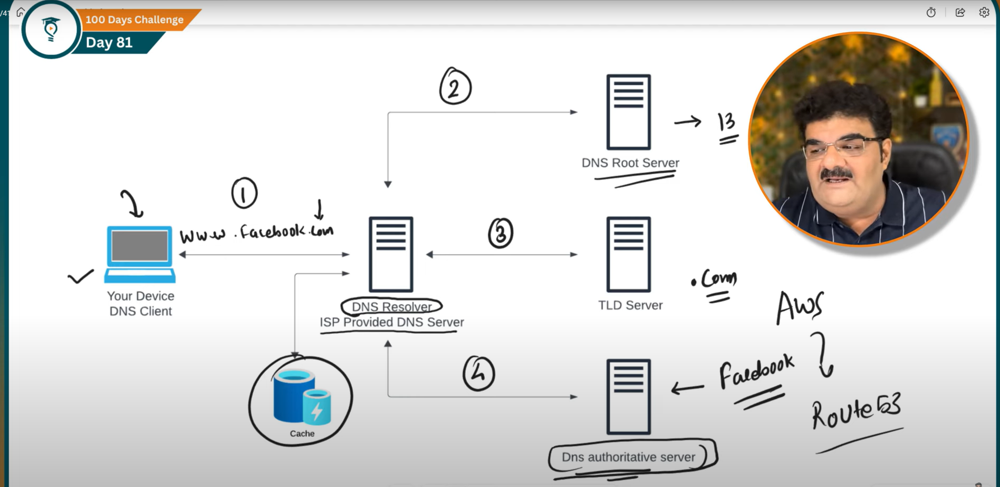

A DNS resolver is like a phonebook helper:
1. When you type website name(eg: fackbook.com)
2. It is goes to DNS resolver (ISP provided DNS server)
3. if DNS resolver does not able resolve it , It ask other DNS servers step by step.
4. First it goes to root DNS server where it will check TLD(top level domain) and redirect the request to their specific TLD server.
5. now it will redirect the request to Dns authoritative server. Finally , it get the correct IP addres
5. it return that ip to you computer so it can connect.

# DAY-82: HOW to register you domain in route 53:
 
 practical done

 ---

 # DAY-83: Record type | Rout 53


In **AWS Route 53**, a *record type* defines the kind of DNS record you want to create. Each record type serves a different purpose in routing traffic. Common ones are:

* **A (Address record)** → Maps a domain name (e.g., `example.com`) to an IPv4 address (e.g., `192.0.2.1`).
* **AAAA** → Same as A, but for IPv6 addresses.
* **CNAME (Canonical Name)** → Points one domain to another domain name (e.g., `www.example.com` → `example.com`).
* **MX (Mail Exchange)** → Routes emails to mail servers for your domain.
* **TXT** → Stores text data, often for verification (e.g., Google site verification, SPF records for email).
* **NS (Name Server)** → Specifies the authoritative name servers for a hosted zone.
* **PTR (Pointer)** → Used for reverse DNS lookups.
* **SRV (Service Locator)** → Defines the location of specific services (rarely used).
* **CAA (Certificate Authority Authorization)** → Restricts which certificate authorities can issue SSL/TLS certs for your domain.
* **Alias Record (Route 53 special type)** → Similar to CNAME but at the root domain level (e.g., `example.com → CloudFront/ELB/S3`). 


---

# DAY- 84: Routing Policy | weighted routing policy (IMPORTANT)
Here’s a clear note on **Weighted Routing Policy in AWS Route 53** with an example:

---

### **Weighted Routing Policy (Route 53)**

* A **Weighted Routing Policy** lets you distribute traffic across multiple resources (like EC2 instances, load balancers, or S3 static sites) in **proportion to assigned weights**.
* You can control **what percentage of traffic** should go to each resource.
### **Example**

Suppose you have two EC2 instances hosting your website:

1. **Instance A** → Weight = 70
2. **Instance B** → Weight = 30

Total weight = 70 + 30 = **100**

* 70% of requests will go to **Instance A**.
* 30% of requests will go to **Instance B**.

👉 If you later want to test a new app version on Instance B, you could start with `Weight = 10` for B and `Weight = 90` for A, then gradually increase B’s weight.

---

### **Use Case**

* Deploying a new app version safely (send 10% traffic to the new instance, 90% to stable one).
* Testing infrastructure changes (e.g., new region setup).
* Custom traffic distribution without an ELB.


# DAY - 85: HOW TO SETUP AWS ROUTE 53 health check? | weighted routing policy

Practical -done

Health check up is used to redirect the request to webserver that are working so that i always show high avaiblity

# Day- 86 : How Geolocation Routing Policy Works?

* It sends users to different servers **based on their physical location**.
* Example:

  * If a user is in **India**, Route 53 can send them to your India server.
  * If a user is in the **US**, it sends them to the US server.
* You can also set a **default server** for users from places you didn’t specify.

👉 Think of it as: *“Where is the user coming from? Okay, send them to the nearest/right server for that place.”*


# Day: 87 - latency based routing policy? | AWS route 53

It send users to the server that gives them the lowest network delay( fastest response) , not just the closest by location

Example: A user in indida might get lower latency from a singapore server than from a Mumbai one ->  Route 53 will send them to singapore.

Goal = Better speed and user experience 

so: 
Geolocation = Where the user is
Latency based = Which server is fastest right now


#  Day 88| What is Geoproximity Routing policy in Route 53 ? 


* It routes users based on **how close they are to your resources** (AWS regions or even non-AWS servers).
* You can also **shift traffic** by using a **bias** (e.g., 70% traffic to US-East, 30% to Europe, even if some users are closer to Europe).
* Requires a **Route 53 Traffic Flow policy** (can’t set it directly like simple/geolocation).

👉 Think of it like:

* **Geolocation** = fixed country/continent mapping.
* **Geoproximity** = dynamic “closer region gets the traffic,” but you can adjust with bias to control flow.


# DAY-89: How Failover Routing policy work in Route 53?


* **Failover Routing Policy** in Route 53 = used for **active-passive setup**.
* You create **two records**:

  * **Primary (Active)** → main server.
  * **Secondary (Passive)** → backup server.
* Route 53 does a **health check** on the Primary.
* If Primary is **healthy** → traffic goes to Primary.
* If Primary **fails** → traffic automatically shifts to Secondary.
* When Primary recovers → traffic goes back to Primary.

👉 Purpose: **High availability and disaster recovery**.

---

# DAY-90: Multivalue Answer Routing Policy in Route 53 ?


* It lets you return **multiple IP addresses/records** for a single DNS query.
* Route 53 can attach a **health check** to each record.
* Only **healthy records** are returned to the user.
* Helps with **basic load balancing** (not as advanced as ELB).
* Max **8 healthy records** are returned in response.

👉 Use it when you want to **distribute traffic** across multiple servers and improve **availability**.

---
# DAY-91:IP based routin Routing Policy | Route 53

Route53 resolve IP based on source IP.
let we have three web server 
webserver1- 1.1.1.1
webserver2- 2.2.2.2
webserver3- 3.3.3.3

now if someone from Gujarat make request then we can make sure it always goes to websever 1

now if someone from Mumbai make request then we can make sure it always goes to websever 2

others will go in  webserver3


Step of create:
1. CIDR collection-> create CIDR block  
3. Create Hosted Zone-> IP based policy


---

# DAY-92: Aws load balancer | What is AWS load balancer?


