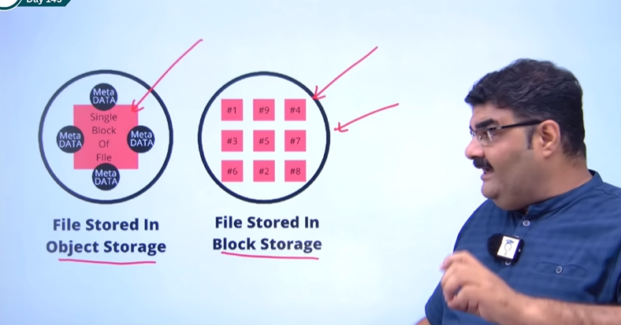

# DAY-145 :  Simple Storage Service 

It is Scalable object storage service 

**What is Object storage ?**
Object Storage is a method of storing data as distinct objects, each with its own identifier and metadata, in a flat environment for scalable and easy access.


**Object Storage VS  Block storage**

*Advantage of Object storage* 
 - Object storage save data as object , Each object is stored sperate and independently.
 - Every object includes the data itself , a unique ID to find it easily , and metadata which is addition about the data.
 - Each object can access directly via its unique Id, allowing for quick retrival of data from anywhere.
 - It's greate for storing large amounts of unstructed datra like photos , vidoes and documents , especially when you need to access them over the internet.

 *Disadvantage Object Storage*
 - Object Storage often has higher latency than block or file storage

 - for storing small files , it can be ineffeicient bcz of their meta data.

 - not optimized for data modifications.
 - some older application may not directly compatiable.


 *Object Storage Use Case*
 - Perfect for keeping big files like photos , videos and large documents which don't fit well in traditional database.
 - Ideal for backup and storing old data because it can handle lot of infortion with costing costing too much
 - Greate for sharing files worldwide easily , like CDN
 because you can access files from anywhere 




# DAY-146: Introduction Of AWS S3 Simple Storage Service

Feature: 
- 99.9% availability 
- 99.99999999999% durability (remember 11*9s)
- files can be 0 Byte to 5 TB 
- Virtually unlimited storage
- versioning
- storage classes
- lifycycle management
- Encryption
- Event Notifications
- Management & Monitoring Tools
- 

**Data Consistency Model for s3** 
- Read after write consistency for PUTS of new objects
- Eventual Consisterncy for overwrite PUTS and DELETES (can take time)

**S3 Charge For**
- Storage
- Request
- Storage management
- Data transfer

**S3 is suitable to store**
- images | PDFs | Videos
- Backup & archives
- State Web Hosting
- Big Web Hosting
- Big Data Analytics
- Log storage
- Machine Learning Data set
- IOT Devices Data
- Data Distribution
- Mobile and Gaming Application
- Enterpise Application


**S3 is Not suitable to store**
Not suitable that required low-latency access , frequent update or transactinal support


# DAY - 148: Storage Class- part 2 S3 express one zone

**S3 Express One Zone:**- Amazon s3 express one zone is a high performance , single zone amazon s3 storage class that is purpose built to deliver consistent, single-digit millisecond data access for your most latency-sensitive applications.

- S3 Express one zone is the lowest latency cloud object storage class available today, with data access speeds up to 10x faster and with request costs 50 percent lower than S3 standards.

_Directory buckets_- It use the s3 express one zone storage class, which is built to be used by performance sensitive applications. With s3 express one zone , you can select a single availibility zone with the options to co-locate your object storage with your compute resources, which proviced the highest possible access speed.

eg: let we have 3 AZ's

- AP-south-1A
- AP-south- 1B
- AP-south-1c

if our application running on AP-south-1A and direcory bucket in AP-south-1c then somehow latency will be increase.so better to keep both instance in same availibility zone.

# Day 149 | S3 Storage Class - Part 3 | What is S3 Glacier ?

Backup vs Archive

| **Feature**          | **Backup Storage**             | **Archive**                 |
| -------------------- | ------------------------------ | --------------------------- |
| **Primary Goal**     | Disaster recovery              | Long-term data preservation |
| **Access Frequency** | Potentially frequent           | Infrequent                  |
| **Retrieval Speed**  | Faster (seconds to minutes)    | Slower (minutes to hours)   |
| **Cost**             | May vary depending on solution | Lower                       |

| Storage Class                     | Designed For                                                 | Availability | Minimum Storage Duration | Retrieval Options                                      | Other Considerations                                                  |
| --------------------------------- | ------------------------------------------------------------ | ------------ | ------------------------ | ------------------------------------------------------ | --------------------------------------------------------------------- |
| **S3 Glacier Instant Retrieval**  | Long-lived data (backups)                                    | 99%          | 90 days                  | Not applicable (in milliseconds)                       | Save **68%** on storage when retrieved one time per quarter           |
| **S3 Glacier Flexible Retrieval** | Backup and archive data that is rarely accessed and low cost | 99.9%        | 90 days                  | Expedited (1–5 min), Standard (3–5 hr), Bulk (5–12 hr) | Up to **10% lower** cost than S3 Glacier Instant Retrieval            |
| **S3 Glacier Deep Archive**       | Archive data that is very rarely accessed and very low cost  | 99.9%        | 180 days                 | Standard (12–48 hr), Bulk (12–48 hr)                   | Provides the **most cost-effective** storage for rarely accessed data |

# 🗓️ Day 150 || AWS S3 || S3 Versioning

**📘 What is S3 Versioning?**
S3 Versioning is a feature that keeps **multiple versions** of an object in the same bucket.
It helps you **recover** from accidental deletion or overwrites.

⚙️ **Key Points:**

- When versioning is **enabled**, every new upload of the same object creates a **new version** with a unique **Version ID**.
- If versioning is **suspended**, existing versions remain, but new uploads overwrite the old version (no new version ID).
- You can **retrieve, restore, or permanently delete** specific versions.
- **Delete marker** is added when an object is deleted (does not immediately remove data).
- Works well with **Lifecycle Policies** to automatically clean up old versions.

Note - if versioning is disable then we can not restore deleted file.
but if versioning is enable then

- it create a new version of file with _deletedMarker_
- we can restore that old version file any time

# 🗓️ Day 151 || AWS S3 || S3 Lifecycle Rule Part 1

_Lifecycle rule s_ - it offer a way to automate data management and optimize storage cost based on access needs.

- Create mutliple rules within a single lifecycle configuration for your bucket.

**Lifecycle rules filter type**

- Prefix
- Object tags
- Object size

# 🗓️ Day 152 || AWS S3 || S3 Lifecycle Rule Part 2

Exercise: what we have to do?

| Time since upload | Storage Class             | Action        | Description                               |
| ----------------- | ------------------------- | ------------- | ----------------------------------------- |
| 0 days            | S3 Standard               | OBject upload | intially upload in standard storage class |
| 30 days           | S3 IA                     | Transition    | move to infrequent access storage class   |
| 90 days           | S3 One Zone IA            | Transition    | move to one zone for further cost svaing  |
| 365 days(1 year)  | Glacier flexible retrival | Transition    | move to glacier storage class             |
| 3 years           | Glacier deep archive      | Transition    | move to deep archive for long term        |
| 10 years          | -                         | Expiration    | delete the object after 10 years          |

Note -Deleted the object is also depend on versioning

if versioning is disable then it will delete permanently.

if versioning is enabled then after 10 year it will create new version with deleted marker. So make sure enable permanent of delete in new version

# 🗓️ Day 153 || AWS S3 || Controlling Access to AWS S3 buckets

The proces of managing who can view, change or delete the object stored within your AWS s2 bucket

_Controlling Access Tools_

- IAM policies
- Bucket policies
- ACLs

How it work

> user -> IAM Policy -> Bucket Policy -> ACL -> Bucket

Note -
if all three( IAM policy, bucket policy, ACL) is not attached then access will be deny
if atleast one allow rule and rest policies are not attachehed then access will be granted.
if atleast one deny rule then no matter about other it will always denial of access.

# 🗓️ Day 154 || AWS S3 || AWS IAM Policy Vs Bucket Policy

**Difference between IAM Policy and Bucket policy**

| Feature       | IAM Policy                   | Bucket Policy                 |
| ------------- | ---------------------------- | ----------------------------- |
| Managment     | Manage via the IAM dashboard | Bucket level                  |
| Format        | Json                         | Json                          |
| Scope         | Identity-based               | Resource based                |
| Use case      | Broad AWS permission         | Specific s3 permission        |
| Attached to   | IAM user, group , roles      | S3 buckets                    |
| Best for      | multiple AWS services        | specific S3 access            |
| Cross-account | Complex configuration        | Ideal for s3 cross-account    |
| Public access | Not applicable               | Explicit publi access control |

# 🗓️ Day 155 || AWS S3 || AWS IAM Policy For S3 Bucket

Practical Overview -

- _Read-Only Access policy_

```
{
    "Version": "2012-10-17",
    "Statement": [
        {
            "Effect": "Allow",
            "Action": "s3:ListAllMyBuckets",
            "Resource": "*"
        },
        {
            "Effect": "Allow",
            "Action": [
                "s3:GetObject",
                "s3:ListBucket"
            ],
            "Resource": [
                "arn:aws:s3:::read-only-bucket-kk",
                "arn:aws:s3:::read-only-bucket-kk/*"
            ]
        }
    ]
}
```

- _Write-Only Access policy_

```
{
    "Version": "2012-10-17",
    "Statement": [
        {
            "Sid": "VisualEditor0",
            "Effect": "Allow",
            "Action": "s3:ListBucket",
            "Resource": "arn:aws:s3:::write-only-bucket-kk"
        },
        {
            "Sid": "VisualEditor1",
            "Effect": "Allow",
            "Action": "s3:PutObject",
            "Resource": "arn:aws:s3:::write-only-bucket-kk/*"
        }
    ]
}
```

- _Full Access policy_

```
{
    "Version": "2012-10-17",
    "Statement": [
        {
            "Sid": "VisualEditor0",
            "Effect": "Allow",
            "Action": "s3:*",
            "Resource": [
                "arn:aws:s3:::full-access-bucket-kunal",
                "arn:aws:s3:::full-access-bucket-kunal/*"
            ]
        }
    ]
}
```

# Day 156 || AWS S3 || AWS Bucket Policy For S3

**_S3 bucket policy for read Access policy_**

```
{
    "Version": "2012-10-17",
    "Statement": [
        {
            "Sid": "Statement1",
            "Effect": "Allow",
            "Principal": {
                "AWS": "arn:aws:iam::155677035996:user/s3-user"
            },
            "Action": [
                "s3:GetObject",
                "s3:ListBucket"
            ],
            "Resource": [
                "arn:aws:s3:::read-only-bucket-kk",
                "arn:aws:s3:::read-only-bucket-kk/*"
            ]
        }
    ]
}
```

Note -but for console access , we need to give permission to list out all the bucket via which user will be access

so make sure in case of console access, attach a policy to user to list out all bucket

```
{
    "Version": "2012-10-17",
    "Statement": [
        {
            "Sid": "VisualEditor0",
            "Effect": "Allow",
            "Action": "s3:ListAllMyBuckets",
            "Resource": "*"
        }
    ]
}
```

- **_S3 bucket policy for write only Access policy_**
- **_S3 bucket policy for full Access policy_**

same as above except action


