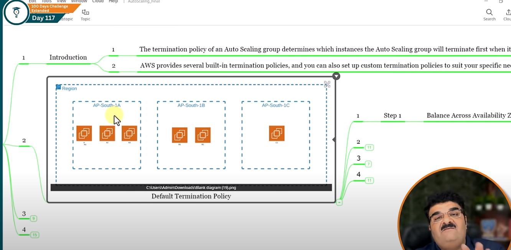
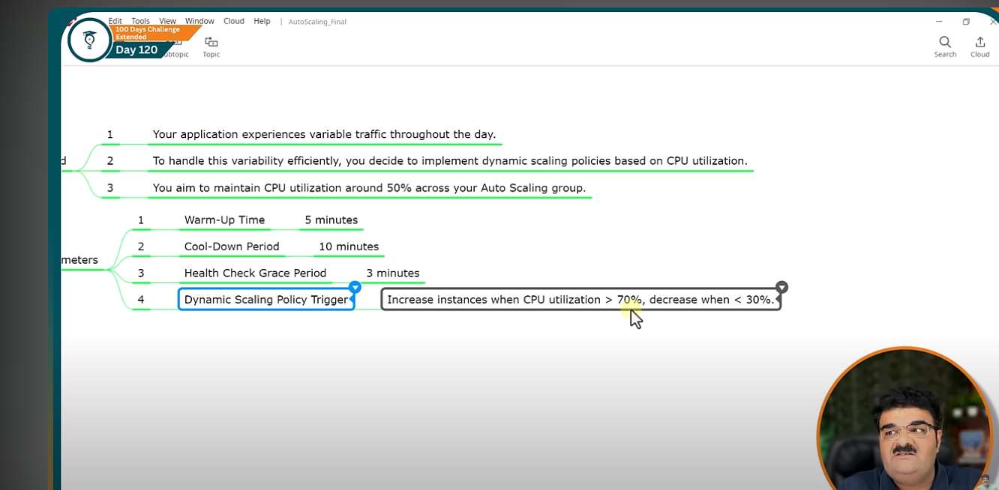
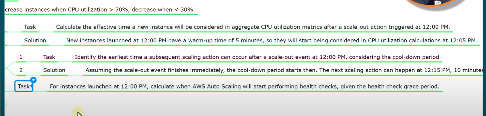

# Day-110: AWS autoscaling

* **Meaning**: Automatically adjusting computing resources (like EC2 servers) based on demand.
* **Goal**: Handle traffic efficiently, reduce cost, and keep performance stable.

---

### **Horizontal Scaling (Scaling Out/In)**

* **What it is**: Adding **more machines/instances** or removing them.
* **Example**: You have 2 EC2s, traffic increases → Auto Scaling adds 3 more (total 5).
* **Best for**: Cloud apps, web apps, microservices.
* **Keyword**: **Add more servers.**

---

### **Vertical Scaling (Scaling Up/Down)**

* **What it is**: Upgrading the **size/power of one machine** (CPU, RAM, storage).
* **Example**: You have a small EC2 (t2.micro) → upgrade to a larger one (t2.large).
* **Best for**: Databases, monolithic apps.
* **Keyword**: **Make server bigger.**

### **Benefit**
**Better fault Toleerance** 
- Better fault tolerence: Auto scaling can detect when an instance is unhealthy , terminated it and launch an instance to replace it.
- You can also configure auto scling to use multiple avaiblity zone. If one availibilty zone become unavailable , Auto scaling  can launch the instance in another AZ automatically.

**Scalablity**
- It automaticaly scale out and scale in based on requirment.

# Day-112: AWS Auto Scaling Group and Launch Template   

EC2 Auto Scaling Groups (ASG)

- EC2 instances are organized into a group so they can scale together.
- Ensures a minimum, maximum, and desired number of instances are always running.

- Supports load balancing (distributes traffic).

- Provides health checks → replaces unhealthy instances automatically.

1. Manual Scaling: 
- Manual Scaling is the most basic way to scale your resource.
- You need to specify the change in the maximum , minimum or desired capacity of your Auto Scaling group. 
- Use case: To increase resources for an infrequent event, such as the release of a new game version that will be available for download and require a user.

# Day-115: AWS Scaling Options Predictive Scaling Introduction and configuration

Predictive Scaling: Predictive Scaling is a advanced feature that enables your cloud infrasture, specifically EC2 instances to automatically scale in or out based on predicted traffic

- By using machine learning models to analyze histrical traffic data (usually three weeks of data is minimum requirement). Predictive Scalling accuratly forecasts future demands and manage the compute capicity of your auto scaling group.

- Predictive Scaling can be used in conjustion with dynamic scaling and schedules scalling , whilte dynamic scaling reponds to changes in real-times, predictive scaling prepare for expected chagnes, offering a more proactive approach.

## Configuration:

### Scale based on forecast: 
On : Predictive Scaling will automatically adjust the number of instances in your Auto Scalling group based on its predictions of future traffic.

means it will check how many need and also make instances

Off : Predictive Scaling will still make predictions about future trafffic, but it will not take any automatic action to scale your instances

### Metric 
- The chosen metric is what the system will analyze to predict future needs.
- These could be CPU utilization, network I/O , request count per target (for load balancer) or any other relevant metric that reflect the load or performance 
- Eg. If you choose CPU utilization , the algorithm will look at past CPU usage trends to forcast future CPU requirements.

###  Target Utilzation 
-  Target Utilization referes to the desired level of resource usage that you want to maintain.

- It's threhold that guide the scaling process.
- eg; If the metric is CPU utilization , setting a target utilization of 50% means your are indicating that the ideal operational state is when each server is using around 50% of its available CPU server.

### pre-launch instance: 
- This setting configure the amount of time by which the instance launch time can be advanced

- eg: The forecast says to add capacty at 10:00 AM then we set 5 Min pre-launch instances then it will launch at 9:55AM

### Buffer maximum capacity above the forecasted capacity:

- This is an extra percentage or number of instance that you choose to add on top of the forecasted capicity

- eg; Suppose predictive scaling algorithm forecasts that you will need 10 instances to meet the demand at certain time

- If your set a buffer maximum capacity of 20% , it will actually provision 12 instances (10 + 20$ of 10) = 12 instances.

# Day -116: AWS Instance Maintenance Policy  

it allow you to define how your Auto Scaling Group replaces instances during the various operation like
- Updating instance to newer version of the AMI
- Replacing unhealthy instance identified by health checks
- Maintaining the desired capacity across the AZ
  
  *Terminate and launch* - unhealthy instances are terminated immediately , then new instances launch

  *Launch before terminating*- New intances are launched first before unhealthy ones are terminated, ensuring minimal downtime

  *Custom Behaviour* - Fine tune scaling behaviour for unique needs with advanced control over replacements and health checks.

  # Day -117: AWS Auto scaling-  Default Termination Policy || AWS 

  *Termination Policy* - it determine which instance the auto scaling group will terminate first when it need to scale in.

  AWS provides serverl built-in termination policies and you can also set up custom termination policies to suite your specific needs

Types:- 

### Default Termination Policies: 

*Step-1 Balance across AZ* - it aim to maintain even distribution of instances across AZs. In our scenario, AP-SOUTH-1A has more instances than other so policies target this AZ to scale in.

*Step-2 Instances protection status* 
- All three instances in AP-south-1a are checked for scale-in protection
- If one of them is marked as protected from scale-in actions, it's excluded from termination.
- Assuming none of these instances have scale-in protection enabled.

*Step 3 Oldest Launch configuraton or Template* :
- Suppose instance A1 and A2 are launch using the same launch configration and instances A3 was launched with a newer version because your update after A1 and A2 were running.

- so A1 , A2 will be target for futher consideration bcz they have the oldest launch configuration
  

  *STEP - 4 Closet to the Next billing hour* - 
  - The default terminology policy consider which instances is closest to the next billing hour to optimized cost saving
  - If instances A1 is 50 minutes into its current hour, and instances A2 is 10 minutes in.

  -  Terminating A1 would result in a smaller portion of unused times that you have already paid for.

  - Instances selected for Termination  - A1

# Day -118: Buit-in termination policies | AWS AUTO scaling

*Allocation Strategies* -
Terminated instances in the auto scaling group to align the remaining instances to the allocation stretegy for the type of  instances that is terminating (eighter a spot instance or on-demand stretegy)

*Oldest launch template or Oldest Launch Configuration*:
 - Terminate instances that have the oldest template or oldest lauch Configuration
 - This policy is useful when you are updating a group and phasing out the instances from a previous configuration.

 *ClosesToNextInstanceHour* - 
  - Terminate instances that are closest to the next billing hour.
  - This policy helps you maximize the use of your instances that have an hourly charge.
  - Only instances that use amazon linux, window or ubuntu are billed in one second increments.

*NewestInstance* :
-  Terminate the newest instances in the group.
- This policy is useful when you are testing a new launch configuration but don't want to  keep in production.

*OldestInstance*:
 - Termincate the oldest instances in the group.
 - This options is useful when you are upgrading the instances in the auto scaling group to new EC2 instance type.
 - you can gradually replace instance of old type with instance of new type.

 # Day- 119: AWS Autoscaling | Custom Termination Policies 

 *Custom Termination Policies* 
 - A custom termination policy provides better control over which instances are terminated and when,
 - A lamda functions is used in conjuctions with custom termination polices to provide advanced , programmable logic for dertermining which instances to terminate during a scale in event. 

  Why to use:
  1. *Better control over which instance to terminate*
     - like you have given some tag and you want to delete only tagged instances
  2. *Graceful shutdown of application*
      - regular rule for terminating EC2 instances might stop them suddenly
      - your lamda function can initiate a graceful shutdown sequence with in the instance before termination
      - This prevent data loss, service disruption , and improve overall application resilience.
  3. *Pre-terminatin action and Data Backup*
     - You might need to perform specific actions before termination an instance, such as  
       - Backing up critical data to other instances or external stroage
       - Draning connections or gracefully terminating running process
       - Unregistering the instance from any service discovery mechanism
     - Your lamda function can execute these pre-termination steps, ensuring data safety and a smooth teransition even when scalling down.
  
  4. *Integration with  External system database*:
    - Certain termination decision might require access to information beyond what auto scaling expose directly
    - Your lambda function can interact with external systems or database (eg; license management , custom health checks) to make informed termination based on broader context.

  5.  Flexibale and dynamic termination logic

  # Day-120: AWS timer| auto scaling timer | Types of timer 

  ### 1.  *Warn-Up timer*

   - This is the period needed for a new instance to initialze and be ready to start handling request after it has been launched

   - During the warm-up time, the instance is considered to be in service, but its matrics(cpu,RAM) are not counted towards the aggregate group metrics for auto scaling decisions.

   - This helps avoid premature scaling decisions while the instance  is not yet fully operational

   - We can configure Warm-Up time with dynamic Scaling policies like step and target tracking.

   - Default value  : optional

  ### 2.  *Cool-down period*
   - in simple, it is the time between triggeringof  two scaling action

   - After a scaling activity (scale out or scale in) , the cool down period is a mendatory wait time before another scaling activity can start.
   - This period allows the system to stablize as its new size. During the cool-down , auto scaling does not initiate  additional scaling activities.
   
   - Cool down period helps to prevent excessive scaling actions in response to temporary spikes or dips in usage.
   
    - Default Value : 300 seconds

  ### 3.  *Health check grace period*
   - this is amount of time tha auto scaling wait before performing health checks on new instance.

   - The grace period starts when an instance enters the inservice state.
   
   - This delay allows applications that require addtional startup time beyond  the OS boot times to fully  intiate before being declared unhealthy.

   - This prevents auto scaling from terminating instances that are actually healty but just needed more time to start

   - Default Period : 300s

  Excise: 
  

  

  last soluton  of health check 12:03

# Day -121: Difference Between AWS Auto Scaling Vs Elastic Load Balancer 

1. **AWS Auto Scaling**:

   * **Purpose**: Automatically adjusts the number of instances (compute capacity) based on demand.
   * **Functionality**: Scales your EC2 instances up or down to match traffic levels.
   * **Use Case**: Useful for maintaining performance during varying traffic loads and optimizing cost by scaling down during off-peak hours.

2. **Elastic Load Balancer (ELB)**:

   * **Purpose**: Distributes incoming traffic across multiple targets (EC2 instances, containers, etc.) to ensure no single instance is overwhelmed.
   * **Functionality**: Improves fault tolerance, distributes traffic efficiently, and helps with high availability.
   * **Use Case**: Used to ensure that traffic is evenly distributed across healthy instances, providing load balancing and redundancy.

**Key Difference**:

* **Auto Scaling** automatically adjusts the number of instances based on traffic.
* **ELB** distributes incoming traffic among the available instances.

In combination, Auto Scaling handles the scaling of instances, and ELB ensures the traffic is balanced across those instances.

