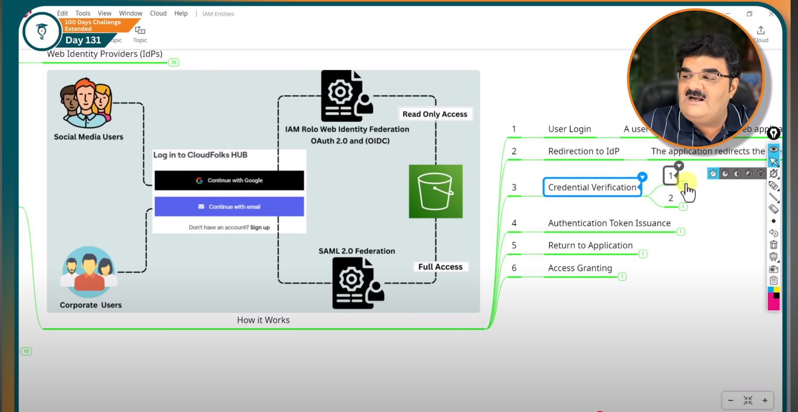

Pending: 122, 123


# Day 124 || IAM Policies - IAM Customer Managed Policies 

We have seen , there are some limitation in aws managed policies
 -  Resource-specific Access Control
 -  No Customization
 -  Broad Permission
 -  Dependence on AWS
 -  Understanding Complexity

 ## Customer Managed Policies

 *Introduction:*
  - Created and managed by users
  - Tailored for specific needs
  - Attached to multiple IAM Entities
  - Manual Update Required
  - Enables Fine-grained Permission Control
  - Versioning and Rollback


 **Example**
 
 *Objective:* -  To configure IAM permission that the user "ec2mastermind" is authorized to managed (eg: start , stop and terminate) only two out of three aws instances
 *Policy User:* - Custom Policy
 *Entity:* - IAM user named EC2MasterMind


# Day 125 || IAM Policies - Inline Policies |


* **Inline Policy** = A policy that is directly attached **inside a single IAM user, group, or role**.
* It **exists only with that identity** → if you delete the user/role, the policy is also deleted.
* Unlike **managed policies** (which are reusable), inline policies are **one-to-one**.
* Best for **custom, tightly-scoped permissions** that you don’t need to reuse elsewhere.
* Inline policies do not have amazon resource name (ARN) 

use case:
 - specific job needs
 - Keep thing secure
 - Short term projects
 - Follow rules
 - Easy to manage for certain case


# Day 126 || IAM Entities - IAM Users 

*Introduction:* 
- it is the core of access control in AWS. They define who can access resources.

### IAM USER
 - An individual entity human user who needs access to AWS access
 - User are used to directly interact with AWS services and resources.

 
# Day 127 || IAM Entities - IAM Group 

*Introduction*
- it is collection of IAM usesrs for easier permission management
- Simplify assigment and management of IAM user permissin
- Grant user access to specific AWS resources and services based on their group membership
- Groups reduces the need for individual user policy  managment.

*Use Case*
-  Grouping user in a same group when need to grant same access 

Key point - 

- Group do not have individual login credential
- User can belong to multiple groups, inheriting permission from each


# Day 128 || IAM Entities - IAM Roles Practical

*Introduction-*

- An IAM role is an IAM entiry that you can create in your account that has specific permission.
- A roles for anyone who needs it. not just for one person, unlike an IAM user.
- A role gives you temporary credentials when assumed, unlike IAM users for whom we create long-term passwords or access keys
- You can use roles to delegates access to users , applications or services that don't normally have access to your AWS resources.

**Role Use case**

1. AWS Services
2. AWS Account | Assume Role - Same account access and Cross Account Access
3. Web Identity/SAML 2.0 Federation

**Role Use case in details**

**AWS Service**: AWS offer over 200+ services for computing storage , database managment, analytics , machine learning and more

- By default, services under a single AWS account operate in isolation and cannot interact with each other.
- Direct access or interaction between services requires explicit authorization to ensure security
- This security principle is applied to limit access to only the resources needed for a service to perform its tasks, enhancing overall security.

Example:

- Imagine you have a web application running on an Ec2 instance in AWS.
- This application needs to upload files to an s3 bucket(storage) for user uploads

## approach-1: Traditional approach , insecure approach

- Store Access key and secreat Key on EC2 - We need to store access key and secret key for an IAM user with s3 upload permission directly on the EC2 instance and this is risky

_Policy that need to attach in IAM USER_

```{
    "Version": "2012-10-17",
    "Statement": [
        {
            "Effect": "Allow",
            "Action": "s3:PutObject",
            "Resource": [
                "BUCKETARN/*"
            ]
        }
    ]
}


```

_User Data script_

```

#!/bin/bash

# Update system

sudo dnf update -y

# Install Python3 and pip3

sudo dnf install python3 python3-pip -y

# Install Flask, Gunicorn, and Boto3

sudo pip3 install Flask gunicorn boto3

# Create a directory for the Flask app and change ownership

sudo mkdir -p /var/www
sudo chown $USER:$USER /var/www
cd /var/www

# Flask application code with embedded AWS credentials (Not Recommended)

cat << EOF > app.py
from flask import Flask, request, render_template_string
import boto3
import uuid

app = Flask(**name**)

# Replace these with your actual S3 bucket name and AWS credentials

S3_BUCKET = 'myapp03'
AWS_ACCESS_KEY_ID = 'YOUR_AWS_ACCESS_KEY_ID_HERE'
AWS_SECRET_ACCESS_KEY = 'YOUR_AWS_SECRET_ACCESS_KEY_HERE'

s3 = boto3.client('s3', aws_access_key_id=AWS_ACCESS_KEY_ID, aws_secret_access_key=AWS_SECRET_ACCESS_KEY)

@app.route('/')
def upload_form():
return render_template_string('''
<!DOCTYPE html>
<html>
<head>
<title>Upload File to S3</title>
<style>
body {
font-family: Arial, sans-serif;
background-color: #004f5d;
color: #ef7f1a;
display: flex;
justify-content: center;
align-items: center;
height: 100vh;
margin: 0;
}
.container {
text-align: center;
background-color: #fff;
padding: 20px;
border-radius: 8px;
box-shadow: 0 4px 6px rgba(0, 0, 0, 0.1);
}
.branding {
font-size: 24px;
color: #004f5d;
margin-bottom: 20px;
}
form {
background-color: #ef7f1a;
padding: 15px;
border-radius: 8px;
}
input[type=file] {
margin-bottom: 10px;
}
input[type=submit] {
background-color: #004f5d;
color: #ffffff;
border: none;
padding: 10px 20px;
border-radius: 5px;
cursor: pointer;
}
input[type=submit]:hover {
background-color: #003440;
}
</style>
</head>
<body>
<div class="container">
<div class="branding">Powered by CloudFolks Hub</div>
<form action="/upload" method="post" enctype="multipart/form-data">
<input type="file" name="file" />
<input type="submit" value="Upload" />
</form>
</div>
</body>
</html>
''')

@app.route('/upload', methods=['POST'])
def upload_file():
if 'file' not in request.files:
return "No file part"
file = request.files['file']
if file.filename == '':
return "No selected file"
if file:
filename = str(uuid.uuid4()) + "-" + file.filename
s3.upload_fileobj(file, S3_BUCKET, filename)
return f"Upload Successful. File: {filename}"

if **name** == '**main**':
app.run(debug=True)
EOF

# Write the systemd service unit file

cat << EOF | sudo tee /etc/systemd/system/flask-app.service
[Unit]
Description=Flask Application
After=network.target

[Service]
User=$(whoami)
WorkingDirectory=/var/www
ExecStart=/usr/bin/python3 -m gunicorn -b 0.0.0.0:80 app:app
Restart=always

[Install]
WantedBy=multi-user.target
EOF

# Reload systemd, enable and start the Flask app service

sudo systemctl daemon-reload
sudo systemctl enable flask-app
sudo systemctl start flask-app

```

## approach-2: Here's how a service role improve security

1. Create an IAM ROLE - You create an IAM role with a policy uploading files to S3
2. Attach service Role to EC2 instance - When launching the EC2 instance , you associate it with this IAM role.
3. Automatic Temporary Credentials - When the ec2 instance starts, it automatically assumes the role and receives temporary credentials to uploads files to s3 securely, without access and secret key

# Day 129 || ROle-use case -> IAM Entities - IAM Roles| AWS Account Assume Role

- Assume role is an AWS IAM action that allows an IAM entity (such as a user, AWS services or application) to temporarily adopt the permission of IAM role.

- When an IAM entity assume a _role_, it receive a set of temporary security credentials that grant it permission based on the policies attached to the role.

- AWS security Token Service(STS) grant temporary credentials, with customizable with customizable lifespan raning from 15 minutes to 12 hours and Default value is 1 hour to access AWS resouces securely using role.

- When workig with IAM roles in AWS, there are primarily two options for how roles can be assumed

1. Same Accounts Access
2. Cross Account Access

### Same Account Access:

- IAM roles are created within the same accounts where the resources are located.
- It's like giving certain individuals or application specific responsibilities or access rights within your organization's AWS environment.

Example: Kunal, a developer , need daily access to _EC2 instances_ but only occasional access to an _s3 buckets_

solution:

1. Create a IAM USer(Kunal)
2. Directly attached policy(EC2-full access)
3. Create an IAM role named "S3-TempAccess"
4. Role Policy (AmazonS3FullAccess) - Attach a policy granting the "S3-TempAccess" role full access

Advantage:

- Security: Temporary credential from the assumed role add another layer of security
  Even if Amit's user credentials are compramised , the attacker would not have access to s3 after credentials expire.
- Centrailize management
- Auditing

# Day 130 || IAM Entities - IAM Roles Assume Role Cross Account Access

In IAM , Assume role functionlity can also be used for cross account access , allowing user or resources in one AWS account to access resources in another account.

example -
Let imagine there are two companies

1. CloudStore Pvt ltd. - Provide cloud storage solution , using amazon s3 to store a vast collection of high-resolution images and editing assests
2. PhotoMagic Pvt. Ltd - Specializes in online photo editing services and want to access cloudStore's S3 bucket containing the dataset for enhancing their photo editing

Requirement: PhotoMagic requires access to cloudStore's datasets store in an amazon S3 bucket to download high-resolutionn images for their editing platform.

_Option 1:_
**Creating an IAM User for photomagic in cloudStore's account** :Cloud store creates a dedicated IAM user for photoMagic , granting it permission to access the specified S3 bucket.
Disadvantage:

- Sharing IAM user credentials poses a significant security risk. If these credential are compromised , unauthorized access could occur, leading to potential data breaches.

- Credential management: cloud store is responsible for securely sharing and managing the lifecycle of these credentials.

- Limited Audit Trail

_Option 2:_

**Ceating a role in CloudStore for photoMagic to Assume**

- CloudStore setUp an IAM role with the necessary permission for the S3 buckets
- This role's trust policy allows entities from PhotoMagic's AWS account to assume the role, providing temporaru access to the bucket.
- In this example _cloudStore_ is trusting account and PhotoMagic is Trusted Account.
- Requirements:
  - Establish a trust relationship by specifying photoMagic's AWS account ID in the role's trust policy.
  - PhotoMagic Assumes the role using AWS STS, obtaining temporary credentials for secure access to the S3 buckets.

advantage:
Enhanced Security - Temporay credentials reduces the risk of long-term credential compromise.
Ease of management - No need for cloudstore to manage seperate IAM user credentials for photomagic , simplifying administrative tasks

# Day 131 || IAM Entities - IAM Roles Web Identity/SAML 2.0 Federation

AWS Identity and access management (IAM) for web identity/SAML 2.0 federation is a security feature that enables secure access to your AWS resources using temporary credentials obtained thorugh an external identit provider (IdP)

**Web Identity Provider** -

1. IdPs offer authentication services, allowing user to prove their identity online using a single set of credentitals.

2. IdPs that use **OAUTH 2.0** and **OpenID Connect(OIDC)** or **SAML 2.0 federation** to provide a secure and standardized way for web applications to rely on the Idp for user authentication and authorization.
3. _OAuth and OpenID connect_ :

   - OAuth 2.0 protocol handles the authorizations aspect , allowing applications to request acess token from the IdP to access user resources on the user's behalf.
   - OpenID Connect(OIDC) is built on the top of OAuth 2.0 fouces on user authentication. It provides a way for IdPs to issue ID token containing user cliams(eg: name, email) to applications.
   - Here _JWT_ token is used for authentication.
   - Example of IdPs using OAuth 2.0 & OIDC : Google , Facebook, amazon

4. _SAML(Security Assertion MarkUp Language):_

   - SAML 2.0 is version of SAML standard for exchaning authentication and authorization data between an identity provider and service provider.
   - It's particularly useful in enterprise scenarios for enabling single sing-On(SSO) allowing users to authenticate once and gain access to multiple applications with re-entring credentials.
   - SAML 2.0 does no use JWT, relying insead of XML for it assertions.
   - Example of Idp using SAML 2.0 : Active Directory Federation service





# Day 132 || IAM Entities - IAM Roles Custom Trust Policy

A **trust policy** in AWS IAM **defines who or what can assume a role**.

### 1. **Purpose**

- Controls **who is allowed to “assume” the role**.
- Works together with the **permissions policy**, which defines **what the role can do**.

---

### 2. **Components of a Trust Policy**

| Component   | Meaning                                                         |
| ----------- | --------------------------------------------------------------- |
| `Effect`    | Allow or Deny the action (`Allow` usually)                      |
| `Principal` | Who can assume the role (user, service, or account)             |
| `Action`    | Always `sts:AssumeRole` for role assumption                     |
| `Condition` | Optional restrictions (like only a specific EC2 instance or IP) |

---

### 3. **Basic Example**

Allow EC2 service to assume a role:

```json
{
  "Version": "2012-10-17",
  "Statement": [
    {
      "Effect": "Allow",
      "Principal": { "Service": "ec2.amazonaws.com" },
      "Action": "sts:AssumeRole"
    }
  ]
}
```

---

### 4. **Custom Condition Example**

Allow only a **specific EC2 instance** to assume the role:

```json
{
  "Version": "2012-10-17",
  "Statement": [
    {
      "Effect": "Allow",
      "Principal": { "Service": "ec2.amazonaws.com" },
      "Action": "sts:AssumeRole",
      "Condition": {
        "StringEquals": {
          "aws:SourceInstanceARN": "arn:aws:ec2:region:account-id:instance/instance-id"
        }
      }
    }
  ]
}
```

---

### 5. **Key Points**

- Trust policy = **who can assume** the role.
- Permissions policy = **what the role can do**.
- Custom trust policies can restrict access using **conditions** (like IP, instance, or account).
- Useful for **tight security control** when multiple entities need temporary access.
