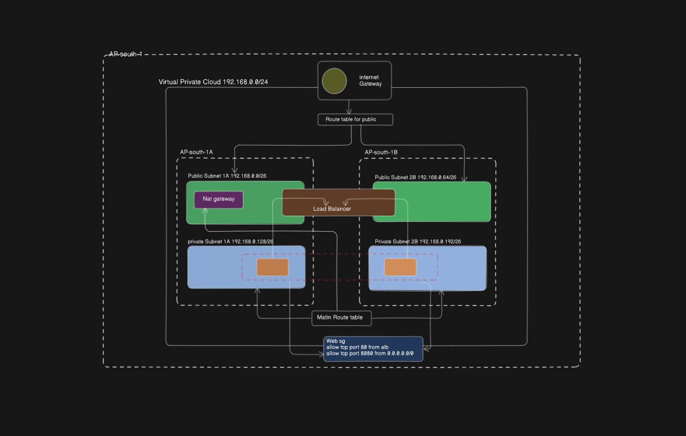

##  Project Title : Resilient and scalable Web applicaton Deployment on AWS

## Project Description: 
 1. This project involve desinging and implementing a highly available and scalable web application infrastrcture on AWS.
 2. The architecture will leverage AWS services to ensure 
   - Fault tolerance
   - Load balancing
   - Secure user access
3. The core of the project is to deploy a web application that can handle varying loads efficiently and maintain high availiablity across multi-AZs.

## Objective:

 *1. High Availability:*- Achieve minimal downtime for the web application by utilizing AZ.
 *2. Scalability:* - Use AWS auto scaling to adjust resources automatically in response to tranffic changes. ensuring efficient performance.
 *3.Security*: - Implement security measure focusing on security groups and secure communication.
 *4. Resilience:* - Develop a resilent application setup that can withstand failures and traffic spikes without manual intervention.

## Core AWS Service Utilization: 

*1.Virtual Private Cloud(VPC):* - Set up a custom VPC to provide a isolated network enviroment. This VPC will have public and private subnets.

*2. Elastic File System(EFS):* -  Leverage EFS for scalable file storage , which can be concurrently accessed by instances for storing shared application data.

*3. Elastic Compute Cloud (EC2):* 
 - Utilize EC@ instances to host the web application.
 - These Instances will server as the compute resources running the application , benefits from AWS's secure, resizable compute capacity

*4. AWS Auto Scaling:* - Configure Auto Scaling to dynamically adjust the number of EC2 instances, ensuring that the application scales effiently with demand.

*5. Application Load Balancer(ALB):* - Utilize an ALB to distribute incoming traffic across multiple EC2 instances in different AZs, enhancing the fault tolerance and availability of  instances

*6. Route53:* - Employ Route 53 for domain management and to route end-user requests to the applications in a reliable and cost effective manner

## Project Phase

*1. Design Phase:* - Architecture the solution, focusing on the applications's security, scalability, availibility requirements.

*2. Implementation Phase:* 
   - Create the VPC, subnets, and security groups
   - Configure EFS
   - Setup custom AMI for auto scaling
   - Deloy the ALB
   - Integrate Route 53 for domain management

 *3. Testing and optimization Phase:* - conduct functional and load testing to ensure the application's performance and scalability meet requirements.

*4. Documentation Phase:* - Produce datailed documentation covering the architecture , configuration and deployement process

## Deliverables
 1. Architecute Diagram and design documention
 2. implementation and configuration guide
 3. Performance and optimization report
 4. A comprehensive project presentation detailing the deployment strategy , encountered challenges and solutions.

